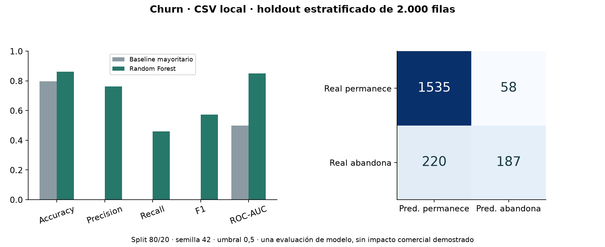

# Churn: entrenamiento, evaluación e inferencia

Proyecto personal de **Ignacio Garrido**, Ingeniero en Informática titulado. Desarrollo propio de la aplicación; librerías, plantillas, datos e imágenes de terceros conservan su autoría.

Pipeline de scikit-learn para estudiar abandono de clientes: validación de columnas, OneHotEncoder, Random Forest y exportación de probabilidades. `Geography` y `Gender` se transforman mediante **el mismo preprocesador entrenado**, incluso al predecir una sola fila.



## Demo reproducible
Python 3.12+, sin cuentas externas:
```powershell
python -m venv .venv
.venv/Scripts/python -m pip install -r requirements.txt
.venv/Scripts/python demo.py
```
Genera datos sintéticos, pipeline y predicciones en `demo_output/`. Comprueba que la predicción no cambia con la composición del lote, acepta países no vistos y no utiliza `Exited` como predictor. Las métricas de esta demo son **sintéticas**.

## Entrenar con tu CSV
El notebook y los scripts llaman al mismo código. Columnas: CreditScore, Age, Tenure, Balance, NumOfProducts, HasCrCard, IsActiveMember, EstimatedSalary, Geography, Gender; entrenamiento requiere además Exited (0/1).
```powershell
python scripts/train.py --csv data/churn_raw.csv --output models
python scripts/infer.py --csv data/clientes.csv --model models/pipeline.joblib --output predicciones.csv
```
`predict_churn.py` es un alias de la misma inferencia. Solo carga modelos joblib generados por ti. El umbral fijo 0,5 indica clasificación del modelo; la probabilidad no está calibrada para decisiones comerciales.

## Evaluación verificada el 05-10-2026
Se ejecutó sobre el CSV local de 10.000 filas, split estratificado 80/20 y semilla 42, sin ajustar el umbral con el test. Random Forest: accuracy **0,861**, precision **0,763**, recall **0,459**, F1 **0,574**, ROC-AUC **0,849**. Baseline mayoritario: accuracy 0,797 y ROC-AUC 0,500. El recall muestra que aún se pierden muchos casos de abandono; no basta con anunciar accuracy.

Detalles, matriz de confusión y hash de la fuente en `docs/evaluacion_local.json`. Una sola partición no acredita desempeño futuro ni reducción de churn. No se incluyen datos originales, identificadores de clientes ni el modelo entrenado con ese CSV.

## Datos y créditos
Referencia de descarga del notebook original: [Churn-Modelling-Dataset](https://github.com/sharmaroshan/Churn-Modelling-Dataset). Su repositorio declara GPL-3.0; la procedencia y permisos específicos del CSV deben revisarse antes de redistribuirlo. La copia de portafolio distribuye únicamente el generador sintético propio.

English: shared training/inference pipeline, stratified holdout evaluation and majority-class baseline. Metrics report model behavior on a local dataset, not business impact.
